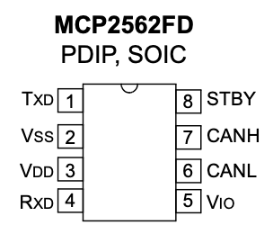

# controlRR

PS4のコントローラで，RRを動作させるプログラム.  
## 0. 現状
> 2023/02/23 
・PS4のコントローラで，足回り・投射機構を制御できる
・足回りの制御は，まだ不完全（エンコーダの値から，指定角度まで回転させるプログラムはアリ）
・差動ステアリングのユニットごとの誤差が大きい

## 1. MCP2562のピン配置 ([データシート](https://akizukidenshi.com/download/ds/microchip/MCP2562FD.pdf))

| Pin Number | Pin Name | Function |
| :---: | :---: | :---: |
| 1 | TXD | 送信データ"入力" |
| 2 | VSS | GND |
| 3 | VDD | 電源(>4V) |
| 4 | RXD | 受信データ"出力" |
| 5 | VIO | 電源(>1.2V) |
| 6 | CANL | CAN Lowレベル電圧I/O |
| 7 | CANH | CAN Highレベル電圧I/O |
| 8 | STBY | スタンバイモード入力 |

## 2. ESP32のピン配置([データシート](https://www.espressif.com/sites/default/files/documentation/esp32-wroom-32_datasheet_en.pdf))

## 3. MCP2562とESP32の接続

| MCP2562 | ESP32 |
| :-------------: | :---: |
| TXD | GPIO_5 |
| VSS | GND |
| VDD | VIN |
| RXD | GPIO_4 |
| VIO | 3.3V |
| CANL | - |
| CANH | - |
| STBY | GND |

`TXD`, `RXD`のピンは，`CAN.setPins(rx, tx)`で変更できる．
`GPIO_5`, `GPIO_4`を選んでいるのは，デフォルトでそうなっていたため！

> Arduino CANライブラリのデフォルトは，[TI SN65HVD230](https://www.ti.com/product/SN65HVD230)を使っている．
